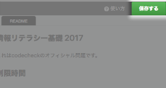

<!-- TODO: WARNING! There are many sections marked `TODO` and `{{}}` in this repo. -->
<!--       - Do all the TODO tasks. -->
<!--       - Fill out all the `{{}}`s. -->
<!--       - Remove all `TODO`s and `{{}}`s when complete. -->
<!--       - For more information, see [codecheck-contents CONTRIBUTING.md](https://github.com/givery-technology/codecheck-contents/blob/master/CONTRIBUTING.md) -->

# {{Challenge名}}

このチャレンジでは技術力とは別に、情報セキュリティに関する  
知識を評価するために広く基礎的事項についての理解度を問います。

## ザ・ミッション
**制限時間内** に左欄の設問を回答してください。

## ルール
- **こまめにSaveボタンをクリック** してください。
- 一度もSaveボタンをクリックしないでTimeUpになった場合は、  
  無回答として提出されてしまいます。  

- 必ずしも1問目から解く必要はありません。  
  解ける設問から回答してください。
- 設問の選択肢は複数チェックが入れられるチェックボックスに  
  なっていますが、すべての設問は  
  **答えをひとつだけ選ぶ「1択」の選択式問題** です。
- 提出前に複数にチェックが入っていないか確認するよう、  
  お願いします。

## 提出方法
- 最後に必ずSaveを実行してください。
- 試験の詳細ページに戻り、  
  「Submit（提出）」ボタンをクリックしてください。

*これは[codecheck](http://app.code-check.io/openchallenges)のチャレンジです。  
初めての方はまず[チュートリアル](https://app.code-check.io/orgs/codecheck/challenges/77)をご覧ください。*
